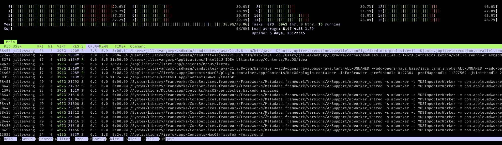

# Parallel Spring Boot Integration Tests

## From >5 minutes to < 30 seconds

<!-- .slide: class="title-slide" -->

<section>
  <div style="display: flex; justify-content: center; align-items: center; gap: 2em; margin-top: 5rem;">
    
    
  </div>
</section>

### Jilles van Gurp

---
### Whoami

- CTO of FORMATION Gmbh
  > Maps for Factories & Logistics.
- Search & Maps, Backend, Full stack Kotlin, ....
- Occasional consultant on Elasticsearch/Opensearch
- Using Java **1995-2017**, Kotlin **2018-now**
  - Yes, I'm a bit "senior"
- Dutch. 16 years in Berlin, Finland & Sweden before that.
- Globally unique handle **@jillesvangurp** (github,x,etc.)

---

## Some OSS stuff I work on


---

<section
  data-background-iframe="https://tryformation.com"
  data-background-interactive>
</section>

<!-- <iframe
src="https://tryformation.com"
style="width: 100%; height: 75vh; border: none;"
allowfullscreen
loading="lazy">
</iframe> -->
---
## Agenda

- ⚡ The need for speed
- 🧪 Unit vs. Integration Tests
- ⚡ Parallel tests HOWTO
  - ⚙️ JUnit Parallel Options
  - What can go wrong?
  - 🧼 Avoiding the Need for Cleanup
  - 🎲 Randomize Test Data
  - ⏱️ Poll, Don’t Sleep
- 🔁 Some closing thoughts

---

## ⚡ The need for speed

> Life is too short for slow builds.

<section>
  <div style="display: flex; gap: 3em; justify-content: center; align-items: flex-start;">
    <ul>
      <li>💥 Interrupted flow</li>
      <li>😴 Procrastination</li>
      <li>💸 Time is $$$</li>
      <li>🔄 Context switches</li>
    </ul>
    <ul>
      <li>📉 Less frequent commits</li>
      <li>🤷 YOLO! Don’t run tests before committing</li>
      <li>🐢 Long feedback cycles</li>
      <li>…</li>
    </ul>
  </div>
</section>
---

## Goal

- Tests should run fast
  - 89 unit tests & **284** integration tests
  - **~23** seconds (excluding compilation)
- Use available CPU (Macbook Pro M4 Max, 48GB)
  - **16 CPU cores**


<!-- .element: style="display:block; margin: 1em auto; width:80%;" -->

---

## Where does all this come from

- I taught a **class on software testing** in 1999. This forced me to dive into a lot of theory.
- 2014: I inherited a messy Ruby codebase where database tests spent **99%** of their time **rebuilding the same DB for every single test function**.
They used copy-pasted data and IDs ... Completely **stupid and frustrating**.
  - That got me thinking about **doing something smarter**.
  - I had **plenty of time to think** waiting for this shit.
- Once you learn how to make parallel test work, it becomes **second nature**.

| | |
|------|------|
| [2016 Article](https://www.jillesvangurp.com/blog/2016-05-25-functional-tests-and-flakyness.html) | [2021 Article](https://dev.to/jillesvangurp/improving-build-speeds-262a) |

---

<!-- .slide: class="title-slide" -->
## The general idea ...

- A **M4 Max** has 16 CPU cores
- Why use only 1 core when you run tests? You could be **16x** as fast.
- Integration tests are IO constrained and spend a lot of time **idling/waiting**.
- **JUnit Parallel Options**

> What could possibly go wrong?

But before we do that a little intro on testing ...

---

## Unit Test

> A **unit test** verifies the behavior of a single, isolated piece of code—typically a function or class—under controlled conditions.
> It runs quickly, avoids external dependencies like databases or APIs, and ensures that logic works as expected in isolation.

---

## Integration Test

> An **integration test** verifies that multiple components of a system work together correctly.
> It exercises real dependencies such as databases, APIs, or messaging systems, and focuses on validating end-to-end behavior rather than isolated logic.

---

## Unit vs. Integration Test (1/2)

| Aspect | Unit Test | Integration Test |
|---------|------------|------------------|
| **Scope** | Single function or class | Multiple components or systems |
| **Dependencies** | None (uses mocks/stubs) | Real systems (DB, APIs, queues, etc.) |
| **Speed** | Very fast (milliseconds) | Slower (seconds or more) |
| **Isolation** | Fully isolated | Interdependent |
| **Purpose** | Validate logic correctness | Validate system interaction and behavior |

---

## Unit vs. Integration Test (2/2)

| Aspect | Unit Test | Integration Test |
|---------|------------|------------------|
| **Reliability** | High consistency | Can vary with environment setup |
| **Maintenance** | Easy and low-cost | Harder and higher-cost |
| **Typical Tools** | JUnit, Mockito | Spring Boot Test, Testcontainers |
| **Execution Frequency** | Every build/commit | Pull Request, before deployment |
| **Failure Cause** | Logic or algorithm bug | Configuration, network, or integration issue |

---

## Test coverage vs. Realism

- Test either for **coverage** or for **realism**
- Unit testing is about test coverage
  - Unit is small enough that you can **test permutations** of input
- Integration testing is about realism
  - **Forget about test coverage**
  - The permutations of possible inputs are **not computable**
  - Next best thing: **Realism: test things that actual users do**

---

## Scenario tests

- The **most realistic** form of integration testing
- Scenario reproduces **sequence of events** that happens in your real system
- **End to end** testing your system **from the outside**.
- As close to the **"real" system** as you can get away with
- **Fake/mock as little** as possible
- **Touch as much** of your system as you can.
- **Don't waste a good scenario**
  - add detail, what else would a user do, assert stuff
- Test **side effects**, trigger **feature interactions**, and the **unexpected stuff** that happens in the real world.
- Test **regressions**. Reproduce things that went wrong for customers. And then ensure they stay fixed.

---

## Spectrum From Unit to Integration test

### Pure Unit test

Logic test, mock test,

### ~~Somewhere in between~~ <span style="font-size: 3rem; animation: blink 1s step-start infinite;"> Half-assed integration test</span>

Whitebox test, database testing with sqlite, using fakes, ...

### 'Pure' Integration tests

BDD, Blackbox test, Performance test, **Scenario Test**, Load test, Stress Test, Contract Test, Smoke Test, Chaos Test, Compliance Test, ...

---

## Half-assed integration tests

- **Coverage is an illusion** (permutations of inputs is like integration test)
- Still **slow and costly**
  - But maybe less costly than a full integration test
- Means you are **testing in production** when you run with the non faked components.
  - Or you do double work by running expensive end to end tests that overlap with your half-assed tests
- Are you being **cheap or frugal**? Why?
- A **proper integration test** is what you really want
- Bad **compromise** beteen performance and realism
- All the **downsides of integration testing without most of the upsides**

> If only we could integration test faster?! Then we could do it properly ....

---

## Parallelize integration tests

- What is **expensive becomes cheap**
- What is **hard becomes easy**
- *No more half-assed integration tests*
- **Maximize value** for the test investments

---

## About our system


---

## What does it do

- Users & Teams
- Map Marker CRUD
- Asset Tracking
- ...
- Async Search indexing pipeline
  - Search is a critical part of our stack


---

## Test Setup

- **Docker Compose** for Elasticsearch, Valkey, and Postgres
  - Docker Compose plugin for gradle that runs before the tests
- **Spring Boot** test context with API server & some test beans
- Simple Kotlin tests
  - **junit 6**
  - **kotest-assertions**
    - Nice idiomatic kotlin assertions
      - `(40 + 2) shouldBe 42`
    - Support for async stuff
      - `eventually {...}` Runs until it passes
- Tests do **REST requests** against our server

---

## A typical scenario test

- **Given** a team and some users and some map markers
- **When** Do some REST calls (CRUD, search, etc.)
- **Wait** for things to happen in Redis/Elasticsearch
- **Assert** Do some more REST calls to figure out current state

```kotlin [3-7|8-24|26-32]
    @Test
    fun `should lookup by specific id`() = runTest {
        val team = createTeam()

        val adminClient = team.admin.client
        val externalId = randomExternalId()
        val macAddress = randomMacAddress()

        val objId = adminClient.updateOrCreateExternalObjects(
            groupId = team.groupId,
            updates =
                listOf(
                    ExternalObjectUpdate(
                        externalId = externalId,
                        updatePointLocation = UpdatePointLocation(position = randomLatLon()),
                        assetInformation = AssetInformation(
                            displayName = "My Tracked Object",
                            specificIds = listOf(
                                SpecificId("name", macAddress, IdType.MAC)
                            )
                        )
                    ),
                ),
        ).shouldBeSuccess().entries.first().value

        eventuallyWithTimeout {
            adminClient.lookupCode(team.groupId, macAddress) shouldBeSuccess {
                it.shouldBeInstanceOf<CodeLookupResult.GeoObject> { obj ->
                    obj.result.id shouldBe objId
                }
            }
        }
    }
```

---

## Let's make this go vroom!

- We have 284 integration tests
- 5-20 REST requests per test
- Elasticsearch, Redis, DB
- Requests 10-100 ms
- + wait/poll time in tests
- How to get this running in **23 seconds**?

> Keep those cores busy!

---

## Junit configuration

### Parallel Test Execution in Gradle

```kotlin [1-19|34-57|70-75|77-87]
configure<ComposeExtension> {
    buildAdditionalArgs.set(listOf("--force-rm"))
    stopContainers.set(true)
    removeContainers.set(true)
    forceRecreate.set(true)
    useComposeFiles.set(listOf("docker-compose-test.yml"))
    // Unique name to avoid conflicts with manual runs
    setProjectName("apitest")

    listOf("/usr/bin/docker", "/usr/local/bin/docker").firstOrNull {
        File(it).exists()
    }?.let { docker ->
        // works around an issue where the docker
        // command is not found
        // falls back to the default, which may work on
        // some platforms
        dockerExecutable.set(docker)
    }
}

tasks.withType<Test> {
    this.jvmArgs("-XX:MaxMetaspaceSize=512m", "-Xms1024m", "-Xmx1024m")
//    logger.lifecycle("in CI: '$runningInCi' failFast is enabled")
    failFast = false
    // note, we start ES on port 9999 so we can avoid having it accidentally put garbage on port 9200
    // if you have another locally running elasticsearch.
    // run with -PdockerComposeTestsEnabled=true to let gradle start docker compose
    // or start it manually
    val excludeTagsProp = System.getProperty("excludeTags")?.takeIf { it.isNotBlank() }
    val excludeTagsList = excludeTagsProp?.split(',')?.map(String::trim) ?: emptyList()
    val skipCompose = "integration-test" in excludeTagsList

    if (!skipCompose) {
        val isUp = try {
            URI.create("http://localhost:9999").toURL().openConnection().connect()
            true
        } catch (e: Exception) {
            false
        }

        logger.lifecycle("test server isUp: $isUp")

        if (!isUp) {
            println("Docker compose not up")
            // if it is not running, use docker compose
            dependsOn("composeUp")
            // this enables us to detect that we want to run es tests
            // deprecated, will be removed
            systemProperty("dockerComposeTestsEnabled", "true")

            // comment this out if you want to reuse ES between test runs when debugging
            // avoids the overhead of restarting docker compose
            finalizedBy("composeDown")
        } else {
            println("Docker compose is up already")

        }
    }
    // https://junit.org/junit5/docs/snapshot/user-guide/index.html
    // note tests run concurrently because of systemProperties["junit.jupiter.*"] below
    // this is a junit thing
    useJUnitPlatform {
        val include = System.getProperty("includeTags")?.takeIf { it.isNotBlank() }
        include?.split(',')?.map(String::trim)?.let { includeTags(*it.toTypedArray()) }
        if (excludeTagsList.isNotEmpty()) {
            excludeTags(*excludeTagsList.toTypedArray())
        }
    }

    systemProperties["junit.jupiter.execution.parallel.enabled"] = "true"
    // executes test classes concurrently
    systemProperties["junit.jupiter.execution.parallel.mode.default"] = "concurrent"
    // executes tests inside a class concurrently
    systemProperties["junit.jupiter.execution.parallel.mode.classes.default"] = "concurrent"
    systemProperties["junit.jupiter.execution.parallel.config.strategy"] = "fixed"

    val threads = max(3,
        Runtime.getRuntime().availableProcessors()-2 // make sure we don't starve es & db & server of cpu cores
    )
    // Why this works: our eventually blocks cause threads to spend a lot of time delaying
    println(
        "running tests with $threads threads on a machine with ${
            Runtime.getRuntime().availableProcessors()
        } CPUs and ${Runtime.getRuntime().maxMemory() / 1024 / 1024} MB memory",
    )
    systemProperties["junit.jupiter.execution.parallel.config.fixed.parallelism"] = threads
    systemProperties["junit.jupiter.execution.parallel.config.fixed.max-pool-size"] = threads

    systemProperties["junit.jupiter.testclass.order.default"] =
        "org.junit.jupiter.api.ClassOrderer\$ClassName"
    systemProperties["junit.jupiter.testclass.order.random.seed"] = "42"
    // works around an issue with the ktor client and redis client needing more than 64 threads in our tests.
    systemProperties["kotlinx.coroutines.io.parallelism"] = "200"

    // junit test runner in gradle ignores @ActiveProfile, go figure
    systemProperty("spring.profiles.active", "test")

    testLogging.exceptionFormat = TestExceptionFormat.FULL
    testLogging.events = setOf(
        TestLogEvent.FAILED,
        TestLogEvent.PASSED,
        TestLogEvent.SKIPPED,
        TestLogEvent.STANDARD_ERROR,
        TestLogEvent.STANDARD_OUT,
    )
    addTestListener(
        object : TestListener {
            val failures = mutableListOf<String>()
            override fun beforeSuite(desc: TestDescriptor) {
            }

            override fun afterSuite(desc: TestDescriptor, result: TestResult) {

            }

            override fun beforeTest(desc: TestDescriptor) {
            }

            override fun afterTest(desc: TestDescriptor, result: TestResult) {
                if (result.resultType == TestResult.ResultType.FAILURE) {
                    val report =
                        """
                    TESTFAILURE ${desc.className} - ${desc.name}
                    ${
                            result.exception?.let { e ->
                                """
                            ${e::class.simpleName} ${e.message}
                        """.trimIndent()
                            }
                        }
                    -----------------
                    """.trimIndent()
                    failures.add(report)
                }
            }
        },
    )
}

---
## Base class for tests

```kotlin [4-8|14-16]
@ActiveProfiles("test")
@SpringBootTest(webEnvironment = SpringBootTest.WebEnvironment.DEFINED_PORT)
// needed so we can have @BeforeAll on non static functions
@TestInstance(
    TestInstance.Lifecycle.PER_CLASS
)
@Execution(ExecutionMode.CONCURRENT)
@Tag("integration-test")
abstract class APITest : ClientCreator {
...

@BeforeAll
fun before() {
    runBlocking {
        testSchemaCreationService.ensureIndicesExist()
    }
}

```

- One shared Spring Context for all tests
- Run Concurrent
- Every test class gets scheduled on its own thread
- Tag as integration test so we can run the unit tests really fast!

```bash
./gradlew  check -DexcludeTags=integration-test

```

---

## DB && Elasticsearch Initialization

```kotlin [14-14|29-31|32-32|34-39|75-77|134-134|168-168|171-180]
private val logger = KotlinLogging.logger {}

@Component
class TestSchemaCreationService(
    private val esProperties: EsProperties,
    private val docStoreProperties: DocStoreProperties,
    private val esSchemaService: EsSchemaService,
    private val searchClient: SearchClient,
    private val userRepository: UserRepository,
    //    private val queueSender: RedisQueueSender,
    private val dbConnectionPool: HikariDataSource,
    private val queueProperties: QueueProperties
) {
    private val mutex = Mutex()
    private val indicesExist = AtomicBoolean(false)

    private suspend fun ignore404(block: suspend () -> Unit) {
        try {
            block.invoke()
        } catch (e: RestException) {
            if (e.status != 404) {
                logger.error(e) { "ignore 404 encountered status ${e.status}" }
                throw e
            }
        }
    }

    suspend fun ensureIndicesExist() {
        if (indicesExist.get()) {
            return
        } else {
            mutex.withLock {
                try {
                    if (docStoreProperties.enableUserDocStore) {
                        dbConnectionPool.withTransaction {conn ->
                            conn.dropDocStoreTable("users")
                            conn.createDocStoreTable("users")
                        }
                    }
                    if (docStoreProperties.enableGroupDocStore) {
                        dbConnectionPool.withTransaction {conn ->
                            conn.dropDocStoreTable("groups")
                            conn.createDocStoreTable("groups")
                            conn.dropDocStoreTable("memberships")
                            conn.createDocStoreTable("memberships")
                        }
                    }
                    if (docStoreProperties.enableCachedResponsesStore) {
                        dbConnectionPool.withTransaction {conn ->
                            conn.dropDocStoreTable("cachedresponses")
                            conn.createDocStoreTable("cachedresponses")
                        }
                    }
                    if (docStoreProperties.enableCachedResponsesStore) {
                        dbConnectionPool.withTransaction {conn ->
                            conn.dropDocStoreTable("privateobjects")
                            conn.createDocStoreTable("privateobjects")
                        }
                    }
                    if (queueProperties.queueType == "postgres") {
                        dbConnectionPool.withTransaction {conn ->
                            conn.dropDocStoreTable(Queue.Enrich.tableName)
                            conn.createDocStoreTable(Queue.Enrich.tableName)
                        }
                    }

                    // check again, might have happened already by now on a different thread
                    // yes, that happened
                    if (indicesExist.get()) {
                        return
                    }
                    //                    queueSender.deleteForTests()
                    ignore404 {
                        if (!docStoreProperties.enableUserDocStore) {
                            searchClient.getIndexesForAlias(IndexDefinition.users.writeAlias).forEach {
                                searchClient.deleteIndex(it)
                            }
                        }
                    }
                    ignore404 {
                        if (!docStoreProperties.enableGroupDocStore) {
                            searchClient.getIndexesForAlias(IndexDefinition.groups.writeAlias).forEach {
                                searchClient.deleteIndex(it)
                            }
                        }
                    }
                    ignore404 {
                        if (!docStoreProperties.enableGroupDocStore) {
                            searchClient.getIndexesForAlias(IndexDefinition.memberships.writeAlias).forEach {
                                searchClient.deleteIndex(it)
                            }
                        }
                    }
                    ignore404 {
                        if (!docStoreProperties.enableCachedResponsesStore) {
                            searchClient.getIndexesForAlias(IndexDefinition.cachedresponses.writeAlias).forEach {
                                searchClient.deleteIndex(it)
                            }
                        }
                    }
                    ignore404 {
                        if (!docStoreProperties.enablePrivateObjectStore) {
                            searchClient.getIndexesForAlias(IndexDefinition.privateobjects.writeAlias).forEach {
                                searchClient.deleteIndex(it)
                            }
                        }
                    }

                    ignore404 {
                        searchClient.getIndexesForAlias(IndexDefinition.objects.writeAlias).forEach {
                            searchClient.deleteIndex(it)
                        }
                    }
                    ignore404 {
                        searchClient.getIndexesForAlias(esProperties.objectEnrichedIndexAlias).forEach {
                            searchClient.deleteIndex(it)
                        }
                    }
                    ignore404 {
                        searchClient.getIndexesForAlias(esProperties.userObjectsEnrichedIndexAlias).forEach {
                            searchClient.deleteIndex(it)
                        }
                    }
                    ignore404 {
                        searchClient.getIndexesForAlias(IndexDefinition.analytics.writeAlias).forEach {
                            searchClient.deleteIndex(it)
                        }
                    }

                    logger.info { "old indices are gone" }

                    // create the indices
                    if (!docStoreProperties.enableUserDocStore) {
                        esSchemaService.migrateUsersIndex()
                    }
                    if (!docStoreProperties.enableGroupDocStore) {
                        esSchemaService.createGroupsIndex()
                        esSchemaService.createMembershipsIndex()
                    }
                    if (!docStoreProperties.enableCachedResponsesStore) {
                        esSchemaService.createCachedResponsesIndex()
                    }
                    if (!docStoreProperties.enablePrivateObjectStore) {
                        esSchemaService.createPrivateObjectsIndex()
                    }

                    esSchemaService.createAnalyticsIndex()
                    esSchemaService.createObjectsIndex()

                    esSchemaService.createEnrichedObjectsIndex(
                        esProperties.objectEnrichedIndexAlias
                    )
                    esSchemaService.createEnrichedObjectsIndex(
                        esProperties.userObjectsEnrichedIndexAlias
                    )

                    searchClient.updateAliases {
                        add {
                            alias = esProperties.enrichedIndexAlias
                            index = esProperties.objectEnrichedIndexAlias
                        }
                        add {
                            alias = esProperties.enrichedIndexAlias
                            index = esProperties.userObjectsEnrichedIndexAlias
                        }
                    }

                    indicesExist.set(true)
                    logger.info { "created indices" }

                    userRepository.create(
                        User(
                            userId = HashUtils.sha1("jilles"),
                            emailAddresses = listOf("jvg@tryformation.com"),
                            firstName = "Jilles",
                            lastName = "van Gurp",
                            bcryptPassword =
                                "1000:ca832812f162d2f772dd24de21d71d70569f9268f65b2016:4df5b5ecba97e00353af2d7f6249233d29ac1fc5091dfa09",
                            roles = listOf(adminRole.name)
                        )
                    )
                    logger.info { "created admin user" }
                } catch (e: Exception) {
                    logger.error(e) { "fatal exception trying to recreate indices: ${e.message}" }
                }
            }
        }
    }
}
```

---

## ⚠️ Potential Problems

> Parallel tests = speed 🏎️ + chaos 💥 if you’re not careful.

- 🧩 **Test interaction** — shared state or data collisions across tests
- 💾 **Resource contention** — DB, ports, temp files, or caches competing for access
- 🕸️ **Non-thread-safe code** — singletons, static mocks, or global config mutated in parallel
- 💤 **Race conditions & timing issues** — async jobs or delayed cleanup causing flakiness
- 👻 **Heisenbugs** — failures that vanish when debugged
- 🧭 **Order dependence** — tests assuming sequence or leftover state

---

## A simple guide to parallel testing

- 🎲 **Randomize test data** Unique IDs prevent collisions
- 🚫 **No Cleaning** Don’t clean between tests
- 🔄 **Poll, don’t sleep** Check until stuff passes, instead of sleeping.
  - Allows other threads to do productive things.
- 🧩 **Embrace Flakiness** These are the bugs you want to find. Deflakification makes your system better.
  - Temporarily run with more threads than your CPU: **invites failures you want to catch early**.
  - **Abuse your tests as a stress test** and find the breaking points.
- 💡**DRY Tests** Don't Repeat Yourself. Avoid copy paste. Invest time in writing shorter tests.
  - Makes it easier to add more tests

> This works on any kind of backend system.
---

## Avoiding shared-state collisions.

- Kotlin's random
  - A few simple functions like `randomLocation()`, `randomExternalId()`, etc.
- inbot-testfixtures
  - Really old library that I haven't touched in 7 years (still in Java :-( )
  - `val person = RandomNameGenerator(seed).`
  - There are many similar libraries.
- **Every test gets its own team and data**
- Ephemeral docker state wiped after test run

> Bottom line: no hard coded strings == no test collissions

---

## Some Helpers

```kotlin [1-8|72-72|74-77|79-85|199-215]
suspend fun createTeam(
    numberOfMembers: Int = 1,
    teamName: String =
        randomNameGenerator.nextPerson().domainName.replace("[.][^.]+$".toRegex(), ""),
    addTrackerUser: Boolean = false,
    formationAdminTeam: Boolean = false,
    vararg groupFeatureFlags: GroupFeatureFlags
): TestTeam {
    val groupId =
        if (formationAdminTeam) {
                adminClient.restCreateFormationAdminGroup(name = teamName) shouldBeSuccess {}
            } else {
                adminClient.restCreateNewGroup(name = teamName) shouldBeSuccess {}
            }
            .groupId
    val groupOwner = testUsers.createNormalUser()
    adminClient.restAddUserToGroup(
        userId = groupOwner.profile.userId,
        groupId = groupId,
        roles = listOf("group_owner")
    ) shouldBeSuccess {}
    val groupAdmin = testUsers.createNormalUser()
    adminClient.restAddUserToGroup(
        userId = groupAdmin.profile.userId,
        groupId = groupId,
        roles = listOf("group_admin")
    ) shouldBeSuccess {}
    val groupMembers =
        List(numberOfMembers) {
                testUsers.createNormalUser().also { member ->
                    adminClient.restAddUserToGroup(
                        userId = member.profile.userId,
                        groupId = groupId,
                        roles = listOf("group_member")
                    ) shouldBeSuccess {}
                }
            }
            .toMutableList()
    groupFeatureFlags.forEach { flag ->
        adminClient.restSetGroupFeatureFlag(groupId, flag,true).shouldBeSuccess()
    }
    val trackerUser = if (addTrackerUser) {
        val trackerUser = testUsers.createNormalUser(firstName = "Tracker").also { member ->
            adminClient.restAddUserToGroup(
                userId = member.profile.userId,
                groupId = groupId,
                roles = listOf("tracker")
            ) shouldBeSuccess {}
        }
        groupMembers.add(
            trackerUser
        )
        trackerUser
    } else {
        null
    }
    return TestTeam(
        name = teamName,
        groupId = groupId,
        members = groupMembers,
        owner = groupOwner,
        admin = groupAdmin,
        internalAdminClient = adminClient,
        serverPort = serverPort,
        trackerUser = trackerUser,
        micrometerMeterRegistry = micrometerMeterRegistry
    )
}


fun randomExternalId(prefix: String = "external") = "$prefix-${UUID.randomUUID()}"

fun randomMacAddress(): String {
    return List(6) { Random.nextInt(0, 256) }
        .joinToString(":") { "%02X".format(it) }
}

fun Bbox.randomLocation(): DoubleArray {
    //    println("$topLeft $bottomRight")

    val lon = Random.nextDouble(topLeft.lon, bottomRight.lon)
    val lat = Random.nextDouble(bottomRight.lat, topLeft.lat)
    return doubleArrayOf(lon, lat)
}

fun randomLocation(near: PointCoordinates = doubleArrayOf(13.0,52.0)) =
    doubleArrayOf(
        Random.nextDouble(near.longitude-0.5,near.longitude+0.5),
        Random.nextDouble(near.latitude-0.5,near.latitude+0.5)
    )
fun randomLatLon(near: LatLon = LatLon(52.0,13.0)) = randomLocation(near.pointCoordinates()).toLatLon()

val wattStrasse11 = LatLon(lat = 52.541187165588674, lon = 13.390887885111196)

fun randomBuildingAndFloor(numberOfFloors: Int=1, near: LatLon = LatLon(52.0,13.0)): NewBuilding {
    val bbox = randomLatLon(near).bboxFromTopLeft()
    val buildingExtId = randomExternalId("building")
    val floors = (0..<numberOfFloors).map { floorLevel ->
        val floorExtId = randomExternalId("floor")
        NewFloor.ImageFloor(
            title = "Floor $floorLevel - $floorExtId",
            level = floorLevel.toDouble(),
            imageUrl = "http://domain.com/floor.png",
            topLeft = bbox.topLeft,
            bottomLeft = bbox.bottomLeft(),
            topRight = bbox.topRight(),
            bottomRight = bbox.bottomRight,
            externalId = floorExtId,
        )
    }
    return NewBuilding(
        title = buildingExtId,
        externalId = buildingExtId,
        floors = floors
    )
}

fun randomZone(
    title: String = "A Zone",
    description: String = "no description",
    externalId: String? = null
) =
    randomLocation()
        .let { GeoGeometry.circle2polygon(20, it[1], it[0], Random.nextDouble(1.0, 20.0)) }
        .let { Geometry.Polygon(it) }
        .let { DEFAULT_JSON.encodeToString(Geometry.serializer(), it) }
        .let { geo ->
            Zone(
                geometryString = geo,
                title = title,
                description = description,
                externalId = externalId,
            )
        }

fun BoundingBox.toBbox() =
    Bbox(
        LatLon(this.northLatitude, this.westLongitude),
        LatLon(this.southLatitude, this.eastLongitude),
    )

fun LatLon.translate(northMeters: Int, eastMeters: Int) =
    GeoGeometry.translate(this.lat, this.lon, northMeters.toDouble(), eastMeters.toDouble()).let {
        LatLon(lat = it[1], lon = it[0])
    }

fun Bbox.randomBbox(height: Int = 10, width: Int = 5): Bbox {
    val p = this.randomLocation().toLatLon()
    return Bbox(p, p.translate(height, width))
}

fun Bbox.randomBuilding(floors: Int = 1): NewBuilding {
    val buildingBox = this.randomBbox()
    val floors =
        (0 until floors).map {
            NewFloor.ImageFloor(
                "floor $it",
                it.toDouble(),
                "https://domain.com/pic$it.png",
                topLeft = buildingBox.topLeft,
                topRight = buildingBox.topRight(),
                bottomLeft = buildingBox.bottomLeft(),
                bottomRight = buildingBox.bottomRight,
            )
        }

    return NewBuilding("aBuilding", floors)
}


suspend fun TestTeam.createMeetings(
    amount: Int,
    inside: Bbox,
    connectedToId: String? = null,
    prefix: String = "event",
    owner: TestUser = this.owner,
    attendees: List<TestUser>? = null,
    keywords: List<String>? = null,
): List<GeoObjectDetails> {
    val newEvents =
        (0 until amount).map {
            val invitations =
                (attendees ?: (0..Random.nextInt(members.size)).map { i -> members[i] })
                    .map { it.id }
                    .map { userId -> EventInvitation(userId, Random.nextBoolean()) }
            NewEvent(
                "$prefix $it",
                attendees = invitations,
                latLon = inside.randomLocation().toLatLon(),
                connectedToId = connectedToId,
                keywords = keywords,
            )
        }
    return owner.client.createEvents(groupId, newEvents).shouldBeSuccess()
}


suspend fun TestTeam.createToilets(
    amount: Int,
    inside: Bbox,
    connectedToId: String? = null,
    prefix: String = "toilet",
): List<GeoObjectDetails> {
    val pois =
        (0 until amount).map { i ->
            NewPoi(
                inside.randomLocation().toLatLon(),
                title = "$prefix $i",
                keywords = listOf("toilet"),
                connectedToId = connectedToId,
            )
        }
    return owner.client.createPOIs(groupId, pois).shouldBeSuccess()
}

suspend fun TestTeam.createPois(
    amount: Int,
    inside: Bbox,
    connectedToId: String? = null,
    prefix: String = "point",
    keywords: List<String>? = null,
): List<GeoObjectDetails> {
    return coroutineScope {
        (0 until amount)
            .map {
                NewPoi(
                    latLon = inside.randomLocation().toLatLon(),
                    title = "$prefix $it",
                    connectedToId = connectedToId,
                    keywords = keywords,
                )
            }
            .let { newPOIs -> owner.client.createPOIs(groupId, newPOIs).shouldBeSuccess() }
    }
}

fun TagList.dump() {
    println("Tags:\n${this.joinToString("\n")}")
}
```
---

## No cleaning between tests

- **Why** Other tests are running
- **Speed** Cleaning is slow. **Not cleaning is faster**.
- **Realism** Real users won't be using an empty database by themselves either
- **Easy** Just skip it. You don't have to do anything for that

> Clean at the beginning and reinitialize your db & schema. Docker **ephemeral state** goes away when you shut down the container.

---

## Polling with eventually

- [kotest-assertions]()

```kotlin [1-7|21-22|23-50|52-52|56-57]
eventuallyWithTimeout {
    adminClient.lookupCode(team.groupId, macAddress) shouldBeSuccess {
        it.shouldBeInstanceOf<CodeLookupResult.GeoObject> { obj ->
            obj.result.id shouldBe objId
        }
    }
}

...

suspend fun <T> eventuallyWithTimeout(
    wait: Duration = 1.minutes,
    message: String? = null,
    log: Boolean = false,
    block: suspend () -> T,
): T {
    eventuallyWaiting.incrementAndGet()
    try {
        var retryCounterLocal = 0
        return measureTimedValue {
                eventually(
                    eventuallyConfig {
                        this.duration = wait
                        if (eventuallyWaiting.get() > 5) {
                            this.initialDelay = 1.seconds
                        } else this.initialDelay = Duration.ZERO

                        // back off the longer it takes
                        this.intervalFn = DurationFn { count ->
                            eventuallyTotalRetryCount.incrementAndGet()
                            retryCounterLocal++

                            val d =
                                when {
                                    count < 2 -> 0.1.seconds
                                    count < 5 -> 0.3.seconds
                                    count < 15 -> 0.6.seconds
                                    // by this time, we are several seconds in so slow down until
                                    // enrichment catches up
                                    else -> 2.seconds
                                }

                            d.also {
                                if(log) {
                                    logger.info {
                                        "retry $count${message?.let { ". $it" } ?: ""}. next wait $it, total waiting: $eventuallyWaiting"
                                    }
                                }
                            }
                        }
                    },
                    block
                )
            }
            .let { tv ->
                eventuallyCompletedBlockCount.incrementAndGet()
                eventurallyTotalSleepMillis.addAndGet(tv.duration.inWholeMilliseconds)
                if(log) {
                    logger.info {
                        "eventually exited after ${tv.duration} and $retryCounterLocal retries. Cumulative sleep time ${eventurallyTotalSleepMillis.get().milliseconds}"
                    }
                }
                tv.value
            }
    } finally {
        eventuallyWaiting.decrementAndGet()
    }
}
```

---

## Eventually stats


<!-- .element: style="display:block; margin: 1em auto; width:100%;" -->

---

## 'fixing' CI performance too

- Github Actions: **1500 build minutes / month**
- Our monthly CI bill: **0$** + a few vm minutes

```yaml [26-49|52-52|53-56]
name: 'Process Pull Request'
on:
  pull_request:
    branches:
    - 'master'
jobs:
  build-and-test:
    name: 'Build And Test'
    runs-on: 'ubuntu-latest'
    timeout-minutes: 30
    steps:
    - id: 'step-0'
      name: 'print env'
      run: |-
        env
        echo "github.event.pull_request.base.ref ${{ github.event.pull_request.base.ref }}"
        echo "github.event.pull_request.head.ref ${{ github.event.pull_request.head.ref }}"
    - id: 'step-1'
      name: 'setup cloud sdk'
      uses: 'google-github-actions/setup-gcloud@v2'
    - id: 'step-2'
      name: 'gcloud auth'
      uses: 'google-github-actions/auth@v2'
      with:
        credentials_json: '${{ secrets.GOOGLE_CLOUD_KEY }}'
    - id: 'step-3'
      name: 'start ci server'
      run: |
        gcloud compute instances start ci-build-machine --zone "us-central1-a" --project "formation-graphqlapi"

        max_attempts=20
        attempt_counter=0
        sleep_duration=2

        while [ $attempt_counter -lt $max_attempts ]; do
            echo "Checking if VM is running (Attempt: $((attempt_counter+1))/$max_attempts)"
            status=$(gcloud compute instances describe --zone "us-central1-a" "ci-build-machine" --project "formation-graphqlapi" | grep "status: RUNNING")

            if [[ $status == *"status: RUNNING"* ]]; then
                echo "VM is up and running!"
                exit 0
            fi

            attempt_counter=$((attempt_counter+1))
            sleep $sleep_duration
        done

        echo "VM did not start after $max_attempts attempts."
        exit 1
    - id: 'step-4'
      name: 'run remote tests'
      run: 'gcloud compute ssh --zone "us-central1-a" "ci@ci-build-machine" --project "formation-graphqlapi" --command "/home/ci/run-test.sh ${{ github.event.pull_request.head.ref }}"'
    - id: 'step-5'
      name: 'stop ci server'
      run: 'gcloud compute instances stop ci-build-machine --zone "us-central1-a" --project "formation-graphqlapi"                '
      if: 'always()'
```

---
## Making testing easy

- Automate repetitive things
- **API Client**: Developer experience for using your API
- With integration tests, test setup is most of the work
  - Make creating stuff easy
  - Make asserting stuff easy
  - **DRY** - automate all the routine stuff
    - Don't just copy paste tests
- Group things you call together in **functions**
- Use **Kotlin DSLs**

---

## Why does this work?

- **I/O-bound != CPU-bound**: Even when each test “feels” heavy, most of the time is network or disk latency.
- Parallelism **hides latency**: Blocked coroutines free CPU time for others.
- **Use idle time** to run other tests.
- Modern hardware is fast: if your CPU fan is idling: **Your laptop is bored!**.



---

## Limitations

- 💻 Not everyone has a fast laptop — been there done that. It sucks 😭
- 🐢 **CI** on the cheap means dealing with slooooow VMs. Once our build took 20+ minutes ⏳ before I used my own VM 🧠
- 🎲 Randomization can also mean **hard to reproduce failures** 💥
- 🧱 **Legacy** tests can be a blocker
- 🎢 Test order, number of CPUs, etc. can make seemingly stable tests **flaky** suddenly
- 🧮 JUnit caps number of threads to number of CPU cores
- 🧩 You need to **keep some CPU available** for your DB, Elasticsearch, and API server ⚙️

---

## Benefits

- ⚡ **Fast tests!** — Integration test at the speed of unit testing (almost).
- 🧠 **Naturally multiuser** — Your real users don't use in isolation either.
- 🤝 **Realistic concurrency** — simulates real-world multi-user load
- 🔍 **Doubles as stresstest** — bottlenecks and locking issues surface early
- 🧩 **Better code quality** — forces testable, thread-safe, stateless design
- 💰 **Lower CI costs** — faster runs = less compute time billed (0$/month)
- 💰 **Zero cost for extra tests** - new tests don't really affect test run time; plenty of idle time left.

---

## Challenges

- 👻 **Heisenbugs & flakiness**
  - 🧠 Finding these is why you test — dealing with them is annoying
  - 🔁 Reproducing bugs isn't always easy — but **knowing you have them** is key
  - 🌈 **It gets better** over time
- 🧩 You need to **design and plan** for concurrent testing — you won’t get it for free
- 🪪 If you have a lot of **hardcoded IDs, names**, etc. in your tests
  - ✏️ Removing those takes some work
- 📋 **Copy/paste reuse** makes your tests hard to maintain
- 🐢 **CI is still slowish** — we fixed it with a fast VM 🚀

### Many solutions to this, this should not stop you

---

## Effective Testing is a mindset

- 🧠 **Design your system** to be easy to test — it makes you a better engineer
- ⚡ Don't accept slow tests — **do something** about it
- 🧪 Remove excuses to **add more tests**
- 💻 Running tests quickly is a great excuse to get a **nice fast laptop**
  - ⏳ Think about that the next time you wait for a build to finish
- 💰 Time is money — **your time** is your money (or your boss’s)
  - You could be doing more fun things than watching paint dry 🎨
- 🌊 **Flow state** is hard to achieve and easy to lose
- 💪 M4 Max with 48 GB = **105 €/month** — other laptops are available 😁

> I run tests about 40 times per day. Now that I can actually do that. This is **priceless**.

---

## Questions?!

- **jillesvangurp** on GitHub, X, etc.
-
- 🚫 we are **not yet** hiring
  - multiplatform Kotlin
  - Kotlin / Spring Boot
  - Kotlin-JS / frontend
  - Kotlin multiplatform libraries
  - ... we love Kotlin

[Slides](https://parallel-testing-2025.jillesvangurp.com)

---

## Links

| | |
|------|------|
| [Website](https://www.jillesvangurp.com) | [FORMATION](https://tryformation.com)|
| [@jillesvangurp@mastodon.world](https://mastodon.world/@jillesvangurp) | [@jillesvangurp.bsky.social](https://bsky.app/profile/did:plc:v3nrxedhxhpuh67qcpu7l2x5) |


